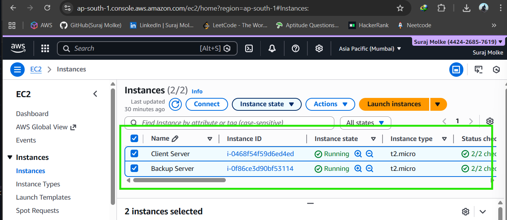
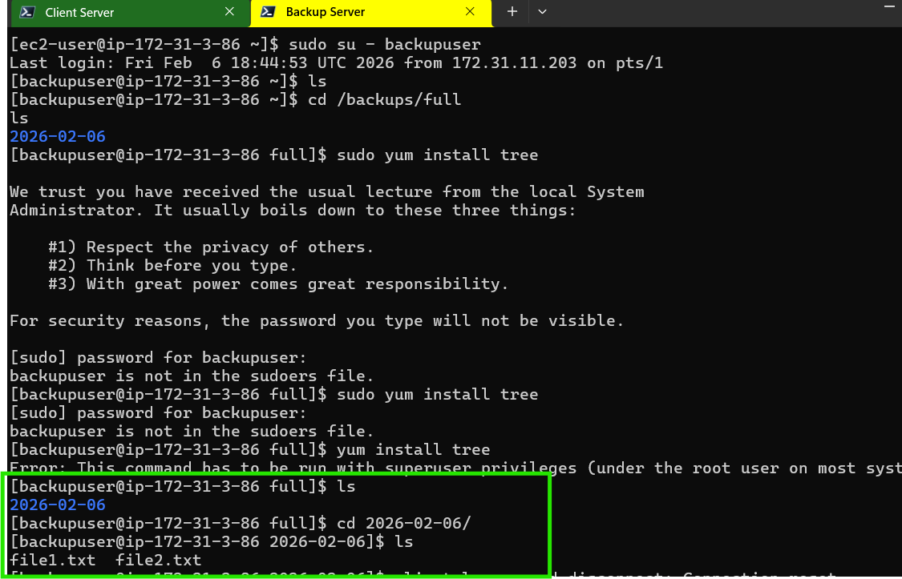
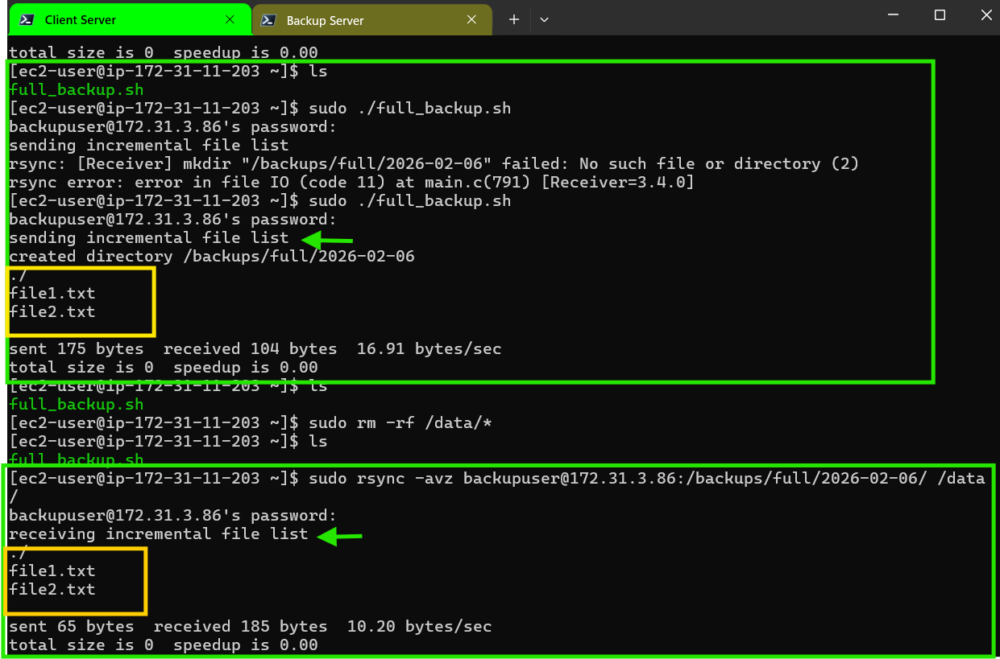

# Linux Backup & Disaster Recovery System (Amazon Linux)

## 📌 Overview
This project demonstrates a **Linux Backup & Disaster Recovery System** using **Amazon Linux EC2**.  
It performs **full backups**, stores them on a **remote backup server**, and supports **data restore** in case of failure.

---

## 🏗️ Architecture
Client EC2 (Amazon Linux)  
→ rsync over SSH  
→ Backup EC2 (Amazon Linux)

---

## 🧰 Tools Used
- Amazon Linux EC2
- rsync
- SSH
- Bash
- cron

---

## 1️⃣ Prerequisites
- Two EC2 instances (Amazon Linux)
  - Client Server
  - Backup Server
- SSH access using EC2 key pair
- Port 22 allowed between servers

---

## 2️⃣ Install Required Packages (Both Servers)
```bash
sudo yum update -y
sudo yum install rsync openssh tar cronie -y
sudo systemctl enable crond
sudo systemctl start crond
```

---

## 3️⃣ Backup Server Configuration

### Create backup user
```bash
sudo useradd backupuser
sudo passwd backupuser
```

### Create backup directories
```bash
sudo mkdir -p /backups/full
sudo mkdir -p /backups/incremental
sudo chown -R backupuser:backupuser /backups
```

---

## 4️⃣ Client Server Configuration

### Create data directory
```bash
sudo mkdir -p /data
sudo touch /data/file1.txt
sudo touch /data/file2.txt
```

---

## 5️⃣ SSH Key Authentication (Client → Backup)

### Generate SSH key (Client)
```bash
ssh-keygen
```

### Copy key to backup server
```bash
ssh-copy-id backupuser@<BACKUP_SERVER_PRIVATE_IP>
```

### Test login (no password)
```bash
ssh backupuser@<BACKUP_SERVER_PRIVATE_IP>
```

---

## 6️⃣ Full Backup Script (Client)

### Create script
```bash
nano full_backup.sh
```

### Script content
```bash
#!/bin/bash
DATE=$(date +%F)
SRC="/data/"
DEST="backupuser@<BACKUP_SERVER_PRIVATE_IP>:/backups/full/$DATE"

rsync -avz $SRC $DEST
```

### Permissions
```bash
chmod +x full_backup.sh
```

### Run backup
```bash
./full_backup.sh
```

---

## 7️⃣ Verify Backup (Backup Server)
```bash
cd /backups/full
ls
cd <DATE>
ls -l
```

---

## 8️⃣ Restore Process (Disaster Recovery)

### Simulate data loss (Client)
```bash
sudo rm -rf /data/*
```

### Restore full backup
```bash
sudo rsync -avz backupuser@<BACKUP_SERVER_PRIVATE_IP>:/backups/full/<DATE>/ /data/
```

### Verify restore
```bash
ls /data
```

---

## 9️⃣ Cron Automation (Optional)

### Weekly full backup
```bash
crontab -e
```

```bash
0 2 * * 0 /home/ec2-user/full_backup.sh
```

---

## 🔐 Security Best Practices
- Use SSH key authentication
- Disable password login after setup
- Restrict backup user permissions

---

## 🧠 Interview Explanation
"I implemented a Linux backup and disaster recovery system on Amazon Linux using rsync and SSH. The system performs automated full backups to a remote EC2 instance and supports fast data restoration in failure scenarios."

---

## 📌 Future Enhancements
- Incremental backups
- Encrypted backups (GPG)
- S3 integration
- Email alerts
